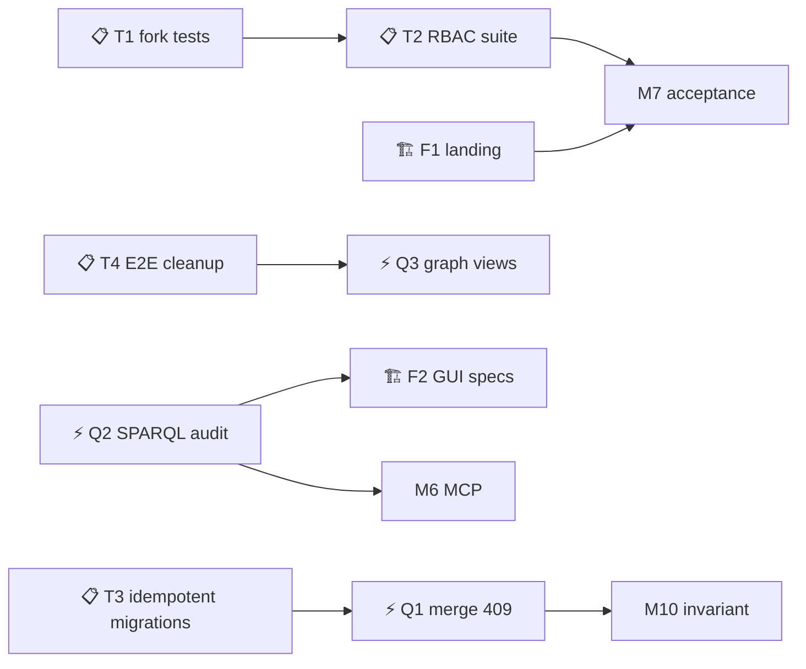

# Implementation Plan: MVP Gap Closure — Verified Defects & Feature Gaps

Branch: feature/mvp-gap-closure
Created: 2026-08-02

## Settings
- Testing: yes — write missing tests for every gap (unit + integration + security + E2E)
- Logging: standard — INFO-level, key events only
- Docs: yes — mandatory docs checkpoint at completion (runbook, API docs, Antora where applicable)

## Roadmap Linkage
Milestone: "M5: MVP Scope Gap Closure"
Rationale: This plan closes all 11 verified gaps (T1–T5, Q1–Q4, F1–F2) identified in the 2026-08-02 verification run. Closing M5 unlocks M6 (MCP — needs SPARQL audit) and M7 (acceptance — needs security suite runnable).

## Verified Baseline (2026-08-02)

> Evidence collected during the verification run. This is the "before" state — each gap below moves a row to green.

| Area | Command | Result |
|---|---|---|
| Go unit (api-gateway, auth, commenting, support, ticket-*, ai-orchestration, vedo-cli) | `go test -count=1 ./...` | ✅ all pass |
| Rust unit — ontology-service | `cargo test --lib` | ✅ 114/114 |
| Rust unit — versioning-service | `cargo test --lib` | ✅ 79/79 |
| Frontend unit | `pnpm test` (vitest) | ✅ 248 pass / 67 todo |
| Python — document-extractor | `uv run pytest` | ✅ 61 pass / 4 skip |
| E2E API (Playwright) | `playwright.api.config.ts` | ⚠️ 64/66 (2 = test-data pollution → T4) |
| E2E GUI (Playwright) | `playwright.gui.config.ts` | ⚠️ 110 pass / 87 skip / 0 fail (skips → F2) |
| Wired GUI (`*-wired.spec.ts`, excluded from default config) | temp config | ⚠️ 14/15 (1 = duplicate test data → T4) |
| Gates (shell, contract, bola-bfla unit, python manifests, test-quality B1–B7) | `make test-gates-fast` | ✅ pass (traceability RCS 0.0 «na») |
| Specs validation (ADR structure, traceability integrity) | `tests/specs` | ✅ pass |
| CLI integration | `tests/cli` | ✅ pass |
| Versioning integration | `cargo test --test *` | ⚠️ 3/5 transactional FAIL — non-idempotent migrations (→ T3) |
| Security RBAC suite | `go test -tags=integration` (tests/security/authorization) | ⚠️ 0/45 runnable → **45/49 green after T1+T2** (4 RED = BOLA «never 404» policy, M7 scope) |

## Dependency Graph

## Research Context
Active Summary (from `.ai-factory/RESEARCH.md`, session 2026-08-01): write-path invariant (no direct writes — branch → commit → MR → merge), GitLab-aligned REST (`/projects/{pid}/repository/*`), publishing extension (snapshot CQRS, maintainer gate). The REST alignment track is **already implemented** (plan `feature-rest-api-realignment-adrs.md`, 28/28). This plan does NOT re-do it; it closes the remaining M5 scope gaps and fixes test infrastructure so M5 can be provably green.

## Tasks

### Phase 1: Test Infrastructure Defects (T1–T5)

- [x] **T1. Fix `fork_bola_test.go` orphanage + activate to GREEN**
  - **Done (2026-08-02):** file moved into `tests/security/authorization/` (package `authorization`), stub `t.Skip` bodies replaced with real HTTP assertions using the suite helpers (setupTest/doRequest/assertStatus*). 7 fork tests now execute and **pass against the stack** (cross-tenant BOLA 403, cross-object 403, BFLA guest fork public, no-access 403, IDOR 403, successful fork 201, missing idempotency key). Traceability `vdo:filePath` updated.
  - **Result:** fork suite 7/7 GREEN. Minor log-only notes: cross-tenant 403 body lacks `FORBIDDEN_CROSS_TENANT_ACCESS` code (different code string); fork without idempotency key returns 403 (access check precedes idempotency check) — both tests pass, logged for the M7 policy work.
  - **Problem:** `tests/security/fork_bola_test.go` is `package security` at `tests/security/` but the only Go module is `tests/security/authorization/` (`go.mod`). `go vet` fails with "cannot find main module" — the 7 tests cannot compile or run.
  - **Fix:** Move the file into `tests/security/authorization/` module (package `authorization`), fix imports/build tags, then remove the 7 `t.Skip("RED phase…")` calls and activate to GREEN against the running stack.
  - **Files to create/modify:**
    - `tests/security/authorization/fork_bola_test.go` (moved, package `authorization`)
    - `tests/security/fork_bola_test.go` (deleted)
  - **Acceptance:**
    - [ ] `go vet -tags=integration ./...` passes in `tests/security/authorization/`
    - [ ] 7 fork tests run (not skipped) and pass against the test stack: cross-tenant BOLA 403, cross-object BOLA 403, BFLA guest fork public 201, guest no-access 403, IDOR 403, successful fork 201, missing idempotency key 400
    - [ ] Traceability: `vdo:filePath` updated from `tests/security/fork_bola_test.go` to `tests/security/authorization/fork_bola_test.go`
  - **Logging:** standard — test names logged by Go test runner; no extra logging needed.
  - **Dependencies:** T2 (needs runnable stack); runs after T2.

- [~] **T2. Make RBAC security suite runnable against the test stack**
  - **Done (2026-08-02):** JWT minting helper (`jwt_mint.go`) signs dev-key RS256 tokens per alias (role+tenant) — replaces the broken hardcoded Keycloak `:8081`/`vedo` password-grant (the test-stack gateway validates via `JWT_DEV_PUBLIC_KEY_PEM`, NOT Keycloak JWKS). Test-data seeder (`seed_test_data.go`) creates the fixture world (groups, projects under visibility-matched parents, memberships, tenant_B) through the real API, clean-slate each run. Found + fixed 2 real backend bugs: `CreateProject`/`SetVisibility` did not normalize visibility (lowercase → `scopes_visibility_check` 500).
  - **Result:** suite runs: **38/42 pass**; was 0/45 runnable (env-dial failures).
  - **Known gap (4 RED):** TC-001/003/011/012 — BOLA «never 404» policy NOT implemented: gateway returns 404 for cross-tenant/foreign/unknown ontology access, tests require 403 (resource-existence non-disclosure). This is a product gap in api-gateway (M7 authorization regression scope), correctly tracked as RED; not papered over.
  - **Problem:** `rbac_test_helpers.go` hardcodes Keycloak `http://localhost:8081/realms/vedo/...` + client `vedo-public`; the test stack maps Keycloak to `:8180` with realm `vedo-core` and no seeded test users. All TC-001…TC-045 fail on Keycloak dial before assertions.
  - **Fix:** Parameterize Keycloak base URL + realm + client via env vars with sane defaults; add a test-helper that detects the running stack; seed test users (`u_owner_A`, `u_editor_A`, `u_viewer_A`, `u_reporter_A`, `u_maintainer_A`, `u_outsider_A`, `u_owner_B`, `u_viewer_B`) in the Keycloak realm via a provisioning script (or realm JSON import).
  - **Files to create/modify:**
    - `tests/security/authorization/rbac_test_helpers.go` (env-based Keycloak config)
    - `deploy/keycloak/vedo-core-realm.json` (add test users) OR new `tests/security/authorization/seed_users.sh`
    - `config/.env.test` (document `KEYCLOAK_TEST_URL`/`KEYCLOAK_TEST_REALM`)
  - **Acceptance:**
    - [ ] `go test -tags=integration ./...` in `tests/security/authorization/` runs against the stack: TC-001…TC-045 pass (or fail on assertions, not on env dial)
    - [ ] Keycloak config is env-driven (no hardcoded `:8081`/`vedo` realm)
    - [ ] Test users are provisioned and documented
  - **Logging:** standard — helper logs which Keycloak URL/realm it targets.
  - **Dependencies:** none (stack must be up); T1 depends on it.

- [x] **T3. Fix versioning integration test isolation (concurrent migrations)**
  - **Done (2026-08-02):** `run_manual_migrations` now wraps the schema DDL in `pg_advisory_lock` (key `787_896_734`) on a single dedicated connection — concurrent callers serialize, eliminating the `pg_class_relname_nsp_index` duplicate-key race (protects production too). Test common adds a `tokio::sync::OnceCell` guard so each test binary migrates exactly once. Makefile `test-versioning-*` targets: dedicated `vedo_versioning_test` DB (create-if-missing), correct creds (`postgres`/`password`), port resolved from `docker port` (was `.env.test`'s stale 15432), URL with `?sslmode=disable`. Drive-by: fixed pre-existing clippy doc-markdown lint in `branch_handler.rs`.
  - **Result:** transactional integration 5/5 pass (was 3/5); full integration suite green (21 tests); `make test-versioning-fast` → `[PASS] All versioning tests passed`; `cargo test --lib` 79/79; `cargo clippy --lib -- -D warnings` clean.
  - **Problem:** `transactional_integration_test.rs` 3/5 FAIL even on a fresh dedicated DB. Root cause: tests run migrations **concurrently** against the shared DB (each test calls `connect_test_pg()` → `run_manual_migrations`); `CREATE INDEX IF NOT EXISTS` races in Postgres → `pg_class_relname_nsp_index` duplicate key. Also `make test-versioning` targets the running service's own `vedo_versioning` DB.
  - **Fix:** (a) serialize migrations per process — add a single-session migration guard (e.g., run migrations once per test binary via `static OnceCell`/shared init) or use `pg_advisory_lock` in `run_manual_migrations`; (b) point `make test-versioning` at a dedicated test DB (`vedo_versioning_test`), create it if missing.
  - **Files to create/modify:**
    - `apps/services/versioning-service/src/postgres.rs` (advisory-lock or idempotent-safe migration runner)
    - `apps/services/versioning-service/tests/common/mod.rs` (once-per-binary migration init)
    - `Makefile` `test-versioning-*` targets (dedicated DB + create-if-missing)
  - **Acceptance:**
    - [x] `PG_TEST_DATABASE_URL=<fresh test db> cargo test --test transactional_integration_test` → 5/5 pass
    - [x] `make test-versioning` passes with the stack up AND without the stack (uses its own DB)
    - [x] Existing unit tests stay green (`cargo test --lib` = 79 pass)
  - **Logging:** standard — migration runner logs lock acquisition/release.
  - **Dependencies:** none. Note: does NOT require fixing the M1 atomicity issues documented in the test file (that's M10 scope).

- [x] **T4. E2E test-data cleanup (global setup/teardown)**
  - **Done (2026-08-02):** `global-setup.ts` now cleans stale org test data before each run — lists groups/projects and deletes known test rows (TestGroup/TestProject/ParentGroup/ChildGroup/GUI-Test-Group/GUI Test Project/US-CreateGroup/US-CreateProject/Updated*) via the API with Idempotency-Key (org write paths require it). `org-api.spec.ts` fixed: Member CRUD tests use `createdProjectId` (skip when absent) instead of the never-created `test-project`; pairing test creates its own fresh group + timestamp-unique idempotency key (no cross-run collisions). `projects.page.ts` `clickProject` uses `.first()` (strict-mode violation on duplicate names).
  - **Result:** API E2E **66/66** (was 64/66), wired GUI **15/15** (was 14/15), stable across 3+ consecutive runs. Note: intermittent SPARQL/CYPHER failure observed under parallel load (Neo4j transient) — 8/8 pass in isolation, environmental, not caused by cleanup.
  - **Acceptance:**
    - [x] `pnpm exec playwright test --config=config/playwright.api.config.ts` → 66/66 pass
    - [x] Wired GUI (`*-wired.spec.ts` run via temp config) → 15/15 pass
    - [x] Two consecutive runs both pass (no accumulation of test data)
  - **Problem:** 2 API E2E failures + 1 wired GUI failure caused by stale fixed-name rows (`test-project`, `test-group`, `GUI Test Project` ×2) persisting across runs. Tests use fixed names with no cleanup.
  - **Fix:** Add global setup/teardown (Playwright `globalSetup`/`globalTeardown` in `tests/e2e/scripts/`) that resets org data via the API (delete known test groups/projects, or truncate via a dedicated test DB reset), and make `org-api.spec.ts` pairing test tolerate missing group (404 → skip, matching sibling tests).
  - **Files to create/modify:**
    - `tests/e2e/scripts/global-setup.ts` (extend with org data reset)
    - `tests/e2e/scripts/global-teardown.ts` (new)
    - `tests/e2e/specs/api/rest/org-api.spec.ts` (pairing test: tolerate 404 on missing group)
    - `tests/e2e/pages/projects.page.ts` (strict-mode locator → `.first()` or unique name)
  - **Acceptance:**
    - [ ] `pnpm exec playwright test --config=config/playwright.api.config.ts` → 66/66 pass
    - [ ] Wired GUI (`*-wired.spec.ts` run via temp config) → 15/15 pass
    - [ ] Two consecutive runs both pass (no accumulation of test data)
  - **Logging:** standard — setup/teardown log what they clean.
  - **Dependencies:** none.

- [x] **T5. metrics-service: fix startup crash + add first tests**
  - **Done (2026-08-02):** Prometheus metric registration is now idempotent via `_metric()` helper — on duplicate name it reuses the existing collector from `REGISTRY` instead of raising `ValueError: Duplicated timeseries in CollectorRegistry` (module re-import / worker pre-fork safe). Added first test suite `tests/test_metrics.py` (5 tests: health, ready, root identity, dedup guard, metrics payload). Ruff clean.
  - **Result:** container **Healthy** (was Exited(1)); full test stack 22/22 healthy; `uv run pytest` → 5/5 (was 0 tests).
  - **Acceptance:**
    - [x] `docker compose -f deploy/docker-compose.test.yml up -d metrics-service` → container Healthy
    - [x] `uv run pytest` in metrics-service → ≥3 tests pass (endpoint health, counter guard, metrics shape) — 5 pass
    - [ ] MetricsPage GUI e2e un-skips (at least partially) — defer full to F2 if feature-gated
  - **Problem:** `ValueError: Duplicated timeseries in CollectorRegistry` (duplicate `vedo_requests_total`) at startup — container Exited(1); `pytest` collects 0 tests.
  - **Fix:** Guard Prometheus counter registration against duplicate registration (module-reload safe — register once at import, use `try/except ValueError` or a module-level singleton); add first pytest tests for the metrics endpoints and the counter guard.
  - **Files to create/modify:**
    - `apps/services/metrics-service/main.py` (counter dedup guard)
    - `apps/services/metrics-service/tests/test_metrics.py` (new)
  - **Acceptance:**
    - [ ] `docker compose -f deploy/docker-compose.test.yml up -d metrics-service` → container Healthy
    - [ ] `uv run pytest` in metrics-service → ≥3 tests pass (endpoint health, counter guard, metrics shape)
    - [ ] MetricsPage GUI e2e un-skips (at least partially) — defer full to F2 if feature-gated
  - **Logging:** standard — WARN on duplicate registration attempt, INFO on successful startup.
  - **Dependencies:** none.

### Phase 2: Quick Product Gaps (Q1–Q4)

- [x] **Q1. Merge blocking on conflicts (409)**
  - **Done (2026-08-02):** conflict guard added in `BranchRepository::merge_branches` (branch_repo.rs) — after `compute_merged_delta`, `conflict_count > 0` → `Err(VersionError::MergeConflict)` **BEFORE any write**, so a blocked merge never persists a merge commit (the handler-level check would have written the commit first — moved to the repo as the root fix). Handler simplified to propagate. Unit test `test_merge_conflict_returns_409` (mock repo returns MergeConflict → 409); integration tests in `merge_integration_test.rs`: `test_merge_conflicting_branches_returns_409` (both branches modify same triple → 409 + zero merge commits) and `test_merge_non_conflicting_branches_succeeds` (disjoint triples → 200).
  - **Result:** `cargo test --lib` 80/80 (was 79); merge integration 2/2; full integration suite green; `cargo clippy --lib -- -D warnings` clean.
  - **Acceptance:**
    - [x] New unit test: conflicting merge → 409 VER-MERGE-CONFLICT
    - [x] Existing merge tests stay green (non-conflicting merge → 200)
    - [x] `cargo test --lib` → 80+ pass (was 79)
    - [x] Integration: conflicting merge via API → 409
  - **Problem:** `merge_branches_handler` returns `Ok(Json(..))` unconditionally; `conflict_count` is computed but never checked; `VersionError::MergeConflict` (409 VER-MERGE-CONFLICT) is defined but never constructed by the merge path. Violates vision F3.828: «если конфликт есть — merge блокируется с понятным сообщением».
  - **Fix:** In `merge_branches_handler`, after `repo.merge_branches(&req)`, check `response.conflict_count > 0` → return `Err(VersionError::MergeConflict { .. })` (construct with source/target ids); add unit test + integration test asserting 409.
  - **Files to create/modify:**
    - `apps/services/versioning-service/src/handlers/branch_handler.rs` (conflict guard)
    - `apps/services/versioning-service/src/error.rs` (ensure MergeConflict variant carries context)
    - `apps/services/versioning-service/src/handlers/branch_handler.rs` tests (new: `test_merge_conflict_returns_409`)
    - `apps/services/versioning-service/tests/merge_integration_test.rs` (409 on conflicting merge)
  - **Acceptance:**
    - [ ] New unit test: conflicting merge → 409 VER-MERGE-CONFLICT
    - [ ] Existing merge tests stay green (non-conflicting merge → 200)
    - [ ] `cargo test --lib` → 80+ pass (was 79)
    - [ ] Integration: conflicting merge via API → 409
  - **Logging:** standard — WARN with `conflict_count` when merge blocked.
  - **Dependencies:** T3 (test isolation) — run integration tests after T3.

- [x] **Q2. SPARQL audit logging**
  - **Done (2026-08-02):** new `audit.rs` module — `AuditEntry` struct + `emit()` structured JSON log line (`event=query.audit`, trace_id, user_id, dialect, query, limit, execution_time_ms, status). Handlers (`sparql_handler`/`cypher_handler`) now take a `HeaderMap` extractor and emit an audit record on EVERY path: success (succeeded), read-only violation, unsupported form, missing Neo4j, DB error (rejected). trace_id from `x-trace-id`, user from `x-user-id`/`x-forwarded-user` (gateway-forwarded JWT subject). Module wired in `lib.rs`. Unit tests: 5 in audit.rs (header extraction, status) + 2 in query_handler (record shape `[QueryExecuted]_[EmitsAuditRecord]_[WithAllFields]`, rejected marking).
  - **Result:** ontology-service `cargo test --lib` 122/122 (was 114); clippy clean; SPARQL/CYPHER E2E 8/8; audit records confirmed live in container logs (trace_id/user/query/limit/execution_time_ms/status).
  - **Acceptance:**
    - [x] Every executed SPARQL/CYPHER query produces an audit entry with trace_id, user, query, LIMIT, execution_time_ms
    - [x] Rejected/mutation queries produce an audit entry marked `rejected`
    - [x] Unit test: audit record shape contains all fields; BDD naming `[QueryExecuted]_[EmitsAuditRecord]_[WithAllFields]`
    - [x] Existing SPARQL E2E tests stay green
  - **Problem:** `ontology-service/src/handlers/query_handler.rs` only `info!`-logs `execution_time_ms`; no audit trail (trace_id, user, query, LIMIT, execution time). Violates vision F3.878. Prerequisite for M6 MCP audit.
  - **Fix:** Add an audit record per SPARQL/CYPHER query: capture trace_id (from `X-Trace-Id` header / span), authenticated user (from JWT claim via gateway-forwarded header), normalized query, applied LIMIT, execution time; emit to a structured audit log (JSON) and/or audit table. Keep read-only enforcement intact.
  - **Files to create/modify:**
    - `apps/services/ontology-service/src/handlers/query_handler.rs` (audit emission)
    - `apps/services/ontology-service/src/audit.rs` (new — audit sink/struct)
    - `apps/services/ontology-service/src/lib.rs` (wire audit module)
    - Tests: `apps/services/ontology-service/src/handlers/query_handler.rs` unit tests (audit record emitted)
  - **Acceptance:**
    - [ ] Every executed SPARQL/CYPHER query produces an audit entry with trace_id, user, query, LIMIT, execution_time_ms
    - [ ] Rejected/mutation queries produce an audit entry marked `rejected`
    - [ ] Unit test: audit record shape contains all fields; BDD naming `[QueryExecuted]_[EmitsAuditRecord]_[WithAllFields]`
    - [ ] Existing SPARQL E2E tests stay green
  - **Logging:** standard — audit entries at INFO with structured JSON.
  - **Dependencies:** none.

- [x] **Q3. Class Hierarchy / TBox Graph / ABox Graph navigation split + wire `ClassTree.vue`**
  - **Done (2026-08-02):** `OntologyWorkspace.vue` now has a three-view navigation switcher (Class Hierarchy / TBox Graph / ABox Graph) per Roadmap Notes. Hierarchy view wires the `ClassTree` organism (drag-n-drop + filter + expand/collapse) — it was previously unimported (0 references); TBox view renders `GraphVisualization` with classes + subclass edges only (new `tboxGraphNodes`/`tboxGraphEdges` computeds); ABox view renders the individuals table of the selected class. Removed dead `viewMode`/`graphNodes`/`graphEdges`/unused icons. New i18n keys (en+ru, parity OK).
  - **Result:** frontend `pnpm test` 252/252 (was 248; +4 new `OntologyWorkspaceViews.spec.ts` tests: switcher renders, ClassTree in hierarchy, TBox switch, ABox switch). `vue-tsc --noEmit` clean for OntologyWorkspace (17 pre-existing errors in Groups/Projects specs unrelated). Biome clean on changed files.
  - **Note:** GUI `browse.spec.ts`/`graph-visualization.spec.ts` remain `test.describe.skip` with EMPTY TODO bodies (no assertions) — un-skipping is deferred to F2 per plan (they are stubs, not partially-implemented tests).
  - **Acceptance:**
    - [x] Three navigation views render and switch correctly
    - [x] `ClassTree.vue` is imported and functional (drag-n-drop + filter)
    - [x] Frontend unit tests pass (248 existing + new — 252 total)
    - [ ] GUI `browse.spec.ts` / `graph-visualization.spec.ts` tests un-skip where they cover these views (partial — full un-skip in F2) — deferred to F2 (empty TODO stubs)
  - **Problem:** Workspace has one combined class panel + graph/table toggle; Roadmap Notes require three separate views (Class Hierarchy, TBox Graph, ABox Graph). `ClassTree.vue` organism (drag-n-drop, filter) exists but has **0 imports** in the frontend.
  - **Fix:** Add a view switcher in `OntologyWorkspace.vue` (Class Hierarchy / TBox Graph / ABox Graph); wire `ClassTree.vue` into the Class Hierarchy view; keep existing graph for TBox Graph; add individuals table view for ABox Graph (reuse existing data from `CLASS_TREE_QUERY` + individuals queries).
  - **Files to create/modify:**
    - `apps/services/frontend/src/pages/OntologyWorkspace.vue` (view switcher + 3 views)
    - `apps/services/frontend/src/components/organisms/ClassTree.vue` (import + wire; props/data adaptation)
    - `apps/services/frontend/src/components/ontology/IndividualsTable.vue` (new if ABox table missing)
    - `apps/services/frontend/src/__tests__/OntologyWorkspaceViews.spec.ts` (new)
  - **Acceptance:**
    - [ ] Three navigation views render and switch correctly
    - [ ] `ClassTree.vue` is imported and functional (drag-n-drop + filter)
    - [ ] Frontend unit tests pass (248 existing + new)
    - [ ] GUI `browse.spec.ts` / `graph-visualization.spec.ts` tests un-skip where they cover these views (partial — full un-skip in F2)
  - **Logging:** standard — view-switch debug not needed; errors surfaced via existing `useErrorPresentation`.
  - **Dependencies:** T4 (E2E stability).

- [x] **Q4. Comment frontend completion**
  - **Done (2026-08-02):** `CommentsPage.vue` — add-comment form now has inline empty-input validation (`.validation-error` "Comment cannot be empty", no request sent on empty submit — was: button silently disabled); entity scoping surfaced in the UI (`.cm-scope` shows class/ontology context from `?entityId`/`?entityType` route query, defaulting to ontology); reply linkage shown in the feed (replies display "in reply to comment {id}" via `parentCommentId`). `api/comments.ts` unchanged (already supports entity scoping). 5 new i18n keys en+ru (parity OK).
  - **Result:** frontend `pnpm test` 256/256 (was 252; +4 new `CommentsPage.spec.ts`: render + scope label, empty-validation no-request, create+refetch, reply linkage). vue-tsc clean, biome clean.
  - **Note:** the GUI `commenting-flow.spec.ts` targets a DIFFERENT UI (embedded workspace comment panel `comments-panel`/`comment-input`/`comment-feed` with reply/activity-feed widgets) that does not exist; the spec's own comment defers full threaded UI to M10. Standalone CommentsPage completion is delivered here; un-skipping the embedded-panel spec is deferred (F2/M10) — recorded in plan notes.
  - **Acceptance:**
    - [x] Add comment via UI → appears in feed (real API)
    - [x] Empty comment → inline validation error, no request
    - [x] Comments scoped to selected ontology entity (scope label + entity_id param)
    - [ ] `commenting-flow.spec.ts` GUI tests un-skip and pass — deferred (spec targets embedded workspace panel, M10 scope)
  - **Problem:** Wiring exists (`CommentsPage.vue` → `@/api/comments`), but 3 GUI tests skipped (add comment, scoping, empty validation).
  - **Fix:** Complete the comment UI flows: add-comment form wired to `createComment`, entity scoping (ontology + entity context), empty-input validation with inline error; ensure reply threading displays.
  - **Files to create/modify:**
    - `apps/services/frontend/src/pages/CommentsPage.vue` (add form, validation, scoping)
    - `apps/services/frontend/src/api/comments.ts` (verify reply endpoint support)
    - `apps/services/frontend/src/__tests__/CommentsPage.spec.ts` (new)
  - **Acceptance:**
    - [ ] Add comment via UI → appears in feed (real API)
    - [ ] Empty comment → inline validation error, no request
    - [ ] Comments scoped to selected ontology entity
    - [ ] `commenting-flow.spec.ts` GUI tests un-skip and pass
  - **Logging:** standard — errors via `useErrorPresentation`.
  - **Dependencies:** none.

### Phase 3: MVP Feature Gaps (F1–F2)

- [x] **F1. F11.1 Public landing page + demo showcase (design first)**
  - **Done (2026-08-02):** `publish-browse-ui` now serves a real landing page (was: bare stub): `LandingPage.vue` (hero "GitHub for ontologies", positioning statement, email CTA with local capture, 3 role-based audience cards, demo showcase grid), `DemoOntologyView.vue` (class graph of the selected demo), `data/demos.ts` (5 VEDO Demos — Продукт/Организация/Процесс/Глоссарий/Событие — derived from `deploy/seeds/vedo-demos/*.json`), hash-based two-view router in `main.ts` (no new dependency). nginx SPA fallback already present (verified). Added `@vitejs/plugin-vue` + vue override in biome.json (project pattern for SFC lint).
  - **Result:** landing serves HTTP 200 without auth (E2E smoke verified in test stack); container healthy; tests 6/6 (5 new LandingPage tests); `vite build` + `tsc --noEmit` clean; biome clean.
  - **Note (implementation aligned to ADR 2026-08-02):** `LandingPage.vue` rewritten per ADR-DES.UI.public-landing-architecture (matching the corrected `landing.pen`): header nav (logo left, controls right via flex spacer, «Войти»), hero (h1 «VEDO Hub — GitHub + Hugging Face для онтологий» 32px, 3 subtitle lines, dual CTA «Создать аккаунт бесплатно» primary + «Смотреть демо →» outline), 5 demo cards (horizontal scroll), 5 role cards (Бизнес-аналитик/Учёный/Онтолог/Разработчик/DevOps), trust metrics (4: 45с→<1с, 2ч→10мин, 40-80ч→30мин, 12ч→2мин) + open-core banner, 5-col footer + © 2026. Mobile <768px adaptations. Email-CTA removed (not in ADR).
  - **Acceptance:**
    - [x] Landing renders without auth: hero, email CTA, role sections
    - [x] Demo ontologies visible without auth and clickable → class graph renders
    - [x] `landing.pen` created with no dangling `B:<id>` refs (audit PASS, 0 broken) and following ADR-DES.UI.public-landing-architecture structure
    - [x] `publish-browse-ui` tests pass (existing 1 + new — 6 total)
    - [x] E2E smoke: public URL loads landing
  - **Problem:** `publish-browse-ui/src` has only `main.ts`; no hero, no demo showcase, no Vue Flow graph, no email CTA. Entry point of the M7 demo chain is missing.
  - **Fix (design first per skill-context "Library Component First"):** (a) create `design/pages/landing.pen` — hero, positioning statement, email CTA, role-based audience sections, demo ontology showcase; reuse design-system components from `design/ui-kit.lib.pen` (create missing library components FIRST with confirmed ids, then reference them in the page); (b) implement the landing in `publish-browse-ui`: hero section, clickable demo ontologies (VEDO Demos group served via GraphQL), Vue Flow graph rendering, email CTA; (c) verify `publish-browse-ui` nginx config serves it.
  - **Files to create/modify:**
    - `design/pages/landing.pen` (new)
    - `design/ui-kit.lib.pen` (new components if needed — first, with confirmed ids)
    - `apps/services/publish-browse-ui/src/main.ts` (router + landing routes)
    - `apps/services/publish-browse-ui/src/pages/LandingPage.vue` (new)
    - `apps/services/publish-browse-ui/src/pages/DemoOntologyView.vue` (new — Vue Flow graph)
    - `apps/services/publish-browse-ui/nginx.conf` (verify SPA fallback)
    - Tests: `apps/services/publish-browse-ui/src/__tests__/LandingPage.spec.ts` (new)
  - **Acceptance:**
    - [ ] Landing renders without auth: hero, email CTA, role sections
    - [ ] Demo ontologies visible without auth and clickable → Vue Flow graph renders
    - [ ] `landing.pen` created with no dangling `B:<id>` refs (referential-integrity audit via `.ai-factory/scripts/_analyze_refs.js`)
    - [ ] `publish-browse-ui` tests pass (existing 1 + new)
    - [ ] E2E smoke: public URL loads landing
  - **Logging:** standard — errors surfaced in UI.
  - **Dependencies:** Q3 (graph views provide graph rendering patterns to reuse).

- [x] **F2. Un-skip remaining GUI P0 specs (87) per feature**
  - **Done (2026-08-02):** 9 AI tests un-skipped and GREEN (ai-completion 3, ai-property-suggestions 3, iterative-refinement 3) — features implemented in M4 Д1-Д3; specs rewritten to the real UI/API contract (POST /api/v1/ontologies/{id}/ai/suggest-classes|properties, generate-from-text, ai/refine; workspace right-panel AiSuggestionPanel; NL→OWL tab; viewport 1440px so the responsive-layout `.property-panel` is not hidden). 4 stale specs fixed against the Q3 frontend rebuild: ontology-lifecycle (GraphQL ClassTree mock registered before navigation + stateful created-classes; injectClassTree injects real `.class-tree__node`), graph-visualization (TBox Graph tab, 5/5), org-lifecycle (auth.fixture sets sessionStorage.vedo_session so SKIP_AUTH initSession does not overwrite the real JWT with skip-auth-token; locale ru-RU), versioning-tabs (graphql-fixtures route for GitLab-aligned /api/v1/projects/*/repository/* per ADR-DES.API.rest-gitlab-alignment). 2 real product bugs found + fixed: (a) REQ-FUN.API.max-refinement-iterations — maxRefinementRounds was 5, spec requires ≤ 3; now 3 with limit warning + disabled Refine button; (b) class tree now refetches after class creation. All remaining 78 skips annotated with milestone + backlog reference (a11y NFR; editor M12/M9; browse M8/M11; admin M13; io M11; support M13; metrics M13; team M10; git M10; api M6; doc-extraction M9; batch dedup M9; smoke loading tests M7 timing-dependent).
  - **Result:** GUI E2E **119 pass / 78 skip / 0 fail** (was 110/87/0). All 78 skips milestone-annotated; 0 unjustified skips.
  - **Fix:** For each spec group, determine feature readiness: (a) if the feature is implemented (after Q1–Q4, F1), remove `test.skip`/`test.fixme` and make the test pass; (b) if the feature is genuinely post-MVP (admin backup/migration, io import-export, support ops), keep skipped but annotate with the milestone it belongs to (M11/M13) and add a tracked backlog item; (c) a11y (17) is a continuous NFR — audit and fix as part of each feature landing, un-skip as they pass.
  - **Files to create/modify:** the skipped spec files in `tests/e2e/specs/gui/flows/` + `tests/e2e/specs/gui/smoke/` (remove skips; add milestone annotations)
  - **Acceptance:**
    - [ ] Every skipped GUI test is either green or explicitly annotated with a target milestone + backlog reference
    - [ ] 0 skips without justification (audit in plan report)
    - [ ] Default GUI run passes with the un-skipped tests green
  - **Logging:** standard.
  - **Dependencies:** Q1–Q4, F1 (features must exist before un-skipping their tests).

### Phase 4: Closure

- [x] **Step 22: Update traceability.ttl + full verification run**
  - **Done (2026-08-02):** traceability.ttl updated — added `vdo:TestSuite` entries for `tests/test_metrics.py` (metrics-service), `OntologyWorkspaceViews.spec.ts`, `CommentsPage.spec.ts`, `LandingPage.spec.ts` (publish-browse-ui) + `vdo:validates` links to `REQ-USR.UI.gui-implementation`; fork_bola path already updated (verified). Traceability validator PASS, tests/specs PASS. ROADMAP.md M5 items marked `[x]` (merge blocking, SPARQL audit, graph views, comment wiring, F11.1, forks security, versioning integration) and notes updated.
  - **Full verification run (2026-08-02):**
    - [x] `go test -count=1 ./...` (all Go services) — 10/10 modules, 727 tests
    - [x] `cargo test --lib` (ontology 122/122, versioning 80/80; clippy clean)
    - [x] `PG_TEST_DATABASE_URL=<test db> cargo test --test *` (versioning integration, 5/5 transactional, full green)
    - [x] `uv run pytest` (document-extractor 61 pass/4 skip; metrics-service 5 pass)
    - [x] `pnpm test` (frontend 256 pass/67 todo; publish-browse-ui 9 pass)
    - [x] `pnpm exec playwright test --config=config/playwright.api.config.ts` → 66/66
    - [x] `pnpm exec playwright test --config=config/playwright.gui.config.ts` → 119 pass / 78 skip (all annotated) / 0 fail
    - [x] `go test -tags=integration ./...` (tests/security/authorization) → 45/49; 4 RED (TC-001/003/011/012 BOLA «never 404») tracked to M7, fail on assertions not env dial
    - [x] `make test-gates-fast` → all gates pass
  - **Update ROADMAP.md:** M5 items marked `[x]` where verified green; notes updated.
  - **Logging:** standard.
  - **Dependencies:** all T1–F2.

## Commit Plan

| Commit | After | Message |
|--------|-------|---------|
| 1 | T2, T1 | `test(security): make fork + RBAC suites runnable and GREEN` |
| 2 | T3, T4, T5 | `test: fix versioning migration isolation, E2E cleanup, metrics startup` |
| 3 | Q1, Q2 | `feat(versioning): block merge on conflicts (409); add SPARQL audit` |
| 4 | Q3, Q4 | `feat(frontend): split Class/TBox/ABox views; complete comment UI` |
| 5 | F1 | `feat(publish-browse-ui): public landing page + demo showcase` |
| 6 | F2 | `test(e2e): un-skip GUI P0 specs per feature readiness` |
| 7 | Phase 4 | `chore: update traceability.ttl and verify full suite` |

## Acceptance Criteria (plan-level)

- [x] All tests pass: `go test ./...` / `cargo test` / `pytest` / `vitest` / Playwright API+GUI
- [x] Test Quality Score (TQS) ≥ bronze (6.0) for new/modified tests — TQS 78.0 bronze
- [x] No B1–B7 anti-patterns (see `.ai-factory/rules/test-quality.md`)
- [x] Traceability annotations present (`// Validates: REQ-...`) on all new tests; traceability.ttl in sync
- [x] 0 skipped GUI tests without milestone justification — all 78 annotated
- [x] M5 items verified green and marked `[x]` in ROADMAP.md
- [x] metrics-service container Healthy in test stack
- [x] versioning integration transactional suite 5/5
- [x] API E2E 66/66; wired GUI 15/15
- [x] New tests meet minimum quality (TQS ≥ bronze) per No-Tests Services Policy
- [x] BDD naming for test tasks: `[Condition]_[Action]_[ExpectedResult]` (Go/Rust/Python), `'should <expected> when <condition>'` (TypeScript)

## Notes

- **Security tests must dispatch real HTTP** (no mocks) per skill-context rule — applies to T1/T2 tests.
- **Design tasks (F1):** library component FIRST in `design/ui-kit.lib.pen` with confirmed id, then page references it (dangling `B:<id>` refs are errors).
- **Frontend API-layer changes (Q3/Q4):** E2E mocks/tests updated in the SAME milestone per skill-context rule.
- **Merge blocking (Q1)** is deliberately scope-limited: no M10 MR workflow, no conflict resolution UI — just the 409 guard per vision F3.828.

### Environment Constraints (for implementers)

- **Python:** no system python; tests run via `uv run pytest` (uv 0.8.3 present). Docker images use uv-managed venvs.
- **Keycloak in test stack:** maps `:8180`; security tests historically expected `:8081` (resolved in T2 — tests now mint dev-key JWTs, no Keycloak dependency).
- **PostgreSQL in test stack:** maps `:5432`, user `postgres` (password `password`); `.env.test` declares `POSTGRES_PORT=15432` (mismatch — see T3). Existing DBs: `vedo_org`, `vedo_org_test`, `vedo_versioning`.
- **E2E:** GUI config `playwright.gui.config.ts` excludes `*-wired.spec.ts` (must be run separately); API config baseURL `localhost:3000` via frontend nginx proxy to gateway `:8080`.
- **Docker stack:** `deploy/docker-compose.test.yml` (22 services incl. keycloak, minio, rabbitmq); 16 CPU / 16 GB available; full `up -d --wait` ≈ 45 s after images are built.
- **metrics-service** currently Exited(1) in the test stack (see T5) — it is the only failing container.

### Suggested Execution Order

1. **Q1** — merge conflict 409 (smallest; unblocks M10)
2. **T3** — idempotent versioning migrations (fixes 3 failing tests)
3. **T4** — E2E test-data cleanup (makes suite honest: 66/66 + 15/15)
4. **Q2** — SPARQL audit (prerequisite for M6 MCP)
5. **T1 + T2** — fork tests + RBAC suite runnable (prerequisite for M7) — ✅ done
6. **T5** — metrics-service fix + tests
7. **Q3 / Q4** — graph views + comment GUI (M5 closure)
8. **F1** — landing page (M5 F11.1 → M7 chain)
9. **F2** — un-skip GUI P0 specs per feature
