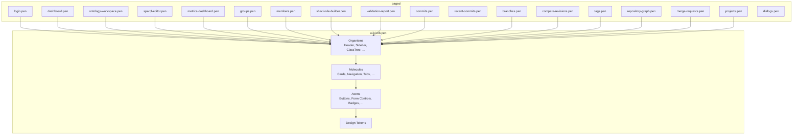

# UI-дизайн VEDO Core — структура и правила работы

Этот документ описывает, как устроена дизайн-система VEDO Core в Penpot, как добавлять новые страницы и компоненты, и как поддерживать ссылочную целостность.

---

## 1. Общая структура

```
design/
├── pages/                     # Страницы и диалоги (отдельные .pen-файлы)
│   ├── login.pen
│   ├── dashboard.pen
│   ├── ontology-workspace.pen
│   ├── sparql-editor.pen
│   ├── metrics-dashboard.pen
│   ├── public-ontology.pen
│   ├── groups.pen
│   ├── members.pen
│   ├── shacl-rule-builder.pen
│   ├── validation-report.pen
│   ├── commits.pen
│   ├── recent-commits.pen
│   ├── branches.pen
│   ├── compare-revisions.pen
│   ├── tags.pen
│   ├── repository-graph.pen
│   ├── merge-requests.pen
│   ├── projects.pen
│   └── dialogs.pen            # 7 диалогов (Create Class, Create Property и др.)
│
├── ui-kit.lib.pen             # Единая библиотека: токены, атомы, молекулы, организмы
└── README.md
```

### Ключевой принцип

Всё многообразие компонентов живёт **в одном файле** — `ui-kit.lib.pen`. Он содержит четыре уровня Atomic Design:

| Уровень | Что входит | Примеры |
|---|---|---|
| **Design Tokens** | Цвета, типографика | `$background`, `$primary`, Status Colors, Priority Colors, шкала `text-4xs`…`text-6xl` |
| **Atoms** | Базовые UI-элементы | Buttons, Badges, Input, Select, Checkbox, Avatar, Icon, Alert, Toast, Spinner |
| **Molecules** | Составные паттерны | Card, Accordion, Tabs, Breadcrumbs, Pagination, DropdownMenu, SearchField |
| **Organisms** | Крупные составные блоки | Header, Sidebar, ClassTree, PropertyPanel, SPARQLQueryEditor и др. (см. ниже) |

Страницы в папке `pages/` импортируют `ui-kit.lib.pen` и собирают интерфейс из молекул и организмов.

---

## 2. Организмы (в `ui-kit.lib.pen`)

Все 23 организма находятся внутри `ui-kit.lib.pen`. Сгруппированы по функциональным областям:

```
General
├── Header
├── Sidebar
├── SidebarCompact
├── OntologyToolbar

Navigation
├── GroupSidebar
├── CollapsedGroupSidebar
├── ProjectSidebar
├── CollapsedProjectSidebar

Ontology Workspace
├── ClassTree
├── PropertyPanel
├── GraphVisualization
├── OntologyMetadata

Repository & VCS
├── CommitHistory
├── DiffView
├── BranchList
├── TagList
├── RepositoryGraph
├── CommentsThread

Collaboration
├── MembersPanel

Querying & Validation
├── SPARQLQueryEditor
├── MetricsDashboard
├── SHACLRuleBuilder
└── ValidationReport
```

> **Правило:** при добавлении нового организма создавайте его внутри `ui-kit.lib.pen` в соответствующей группе и помечайте `"reusable": true`.

---

## 3. Как создать новую страницу

1. Создайте `.pen`-файл в `pages/`. Имя — `kebab-case` (например, `audit-log.pen`).
2. Добавьте в файл поле `imports`:

```json
{
  "imports": {
    "B": "../ui-kit.lib.pen"
  }
}
```

> Алиас `B` — единственный; все компоненты (атомы, молекулы, организмы) берутся из `ui-kit.lib.pen`.

3. Ссылайтесь на компоненты по формату `"B:идентификатор"`:

```json
{
  "type": "ref",
  "ref": "B:qpgfz"     // Header (организм)
}
{
  "type": "ref",
  "ref": "B:c8T4z"     // Button (атом)
}
```

4. Установите размер страницы **FullHD (1920×1080 px)** — это целевой экран для всех страниц.
5. Соберите layout страницы, используя Header, Sidebar и нужный организм по схеме ниже.

### Типовая структура страницы

```
┌─────────────────────────────────────────┐
│  Header (Organism)                      │
├──────────┬──────────────────────────────┤
│ Sidebar  │  Content Area                │
│ (Organism)│                              │
│          │  ┌─ Page Title ────────────┐  │
│          │  │  Title    [Action]      │  │
│          │  └─────────────────────────┘  │
│          │  ┌─ Main Organism ─────────┐  │
│          │  │                         │  │
│          │  │ (CommitHistory,         │  │
│          │  │  SPARQLQueryEditor,     │  │
│          │  │  MembersPanel, …)       │  │
│          │  │                         │  │
│          │  └─────────────────────────┘  │
└──────────┴──────────────────────────────┘
```

### Исключения из шаблона

| Страница | Особенность |
|---|---|
| **login.pen** | Центрированная карточка, без Header и Sidebar |
| **ontology-workspace.pen** | Кастомный сплит: ClassTree \| GraphVisualization \| PropertyPanel |
| **dialogs.pen** | Модальные окна без общего лэйаута |
| **public-ontology.pen** | Публичный режим «только чтение» |

---

## 4. Как добавить новый организм

1. Откройте `ui-kit.lib.pen` в Penpot.
2. Создайте фрейм с именем по схеме `Organism/YourName` (например, `Organism/AuditTimeline`).
3. Установите свойство **Reusable** (`"reusable": true`).
4. Поместите организм в соответствующую группу (General / Navigation / Ontology Workspace / …).
5. Если организм использует молекулы или атомы — просто перетащите их из той же библиотеки (внутри `ui-kit.lib.pen` локальные ссылки не требуют префикса).
6. Для организма, который должен работать в светлой теме, создайте вариант с суффиксом `(Light)` и укажите `"theme": { "mode": "light" }`.

---

## 5. Импорты и ссылочная целостность

### Как настроить импорты

Каждый `.pen`-файл, который использует чужие компоненты, обязан содержать поле `imports` — словарь алиасов → относительных путей.

**В файлах страниц (`pages/*.pen`):**

```json
{
  "imports": {
    "B": "../ui-kit.lib.pen"
  }
}
```

**В `ui-kit.lib.pen`:** импорты не нужны — все компоненты внутри одного файла.

### Формат кросс-файловых ссылок

```
"алиас:идентификатор"
```

Примеры:

```json
{ "type": "ref", "ref": "B:qpgfz" }     // Header из ui-kit.lib.pen
{ "type": "ref", "ref": "B:c8T4z" }     // Button из ui-kit.lib.pen
```

### Правила

1. Все `ref` на компоненты из `ui-kit.lib.pen` **обязаны** содержать алиас `B:`.
2. `ref` без `:` считается локальной ссылкой (на элемент внутри того же файла).
3. После любого изменения запускайте проверку: все `"ref"` должны содержать `":"` либо указывать на локальный элемент.
4. Пути в `imports` указываются **относительно файла**, в котором находится `imports`. Страницы в `pages/` пишут `"../ui-kit.lib.pen"`, так как файл лежит на уровень выше.

---

## 6. Схема зависимостей



> Все страницы импортируют только `ui-kit.lib.pen`. Отдельной библиотеки организмов нет.

---

## 7. Соглашения по именованию

| Сущность | Формат | Пример |
|---|---|---|
| Файл страницы | `kebab-case.pen` | `ontology-workspace.pen` |
| Организм | `Organism/CamelCase` | `Organism/ClassTree` |
| Молекула | `Molecule/CamelCase` | `Molecule/GroupsToolbarSearch` |
| ID фрейма | Префикс по странице + CamelCase | `loginPCard`, `dashGreeting` |
| Вариант для светлой темы | Имя + `(Light)` | `Organism/Header (Light)` |

---

## 8. Тёмная и светлая темы

Каждый организм в `ui-kit.lib.pen` представлен в двух вариантах:

- **Тёмная тема** — основной вариант, без суффикса (например, `Organism/Header`).
- **Светлая тема** — вариант с суффиксом `(Light)` и `"theme": { "mode": "light" }` (например, `Organism/Header (Light)`).

При редактировании организма вносите изменения в оба варианта, чтобы тёмная и светлая темы оставались синхронизированными.
